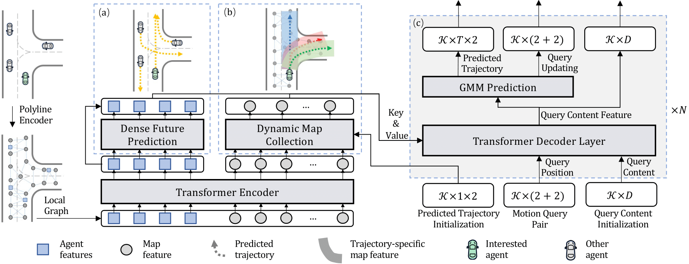

# 东风预测比赛项目说明

## 参赛信息

Author name: 汪建成
Author school: 吉林大学
Author email: wjc24@mails.jlu.edu.c

## 项目总体介绍

本参赛项目 DF_EDA 基于 MTR 与 EDA 项目基础上使用 DF_Dataset(东风比赛官方提供)及 Waymo_Dataset(WOMD开源数据集所得) 数据集进行 Prediction 比赛项目开发。

说明：本项目构建模型参数较大，约为 657 万个参数，通过实验发现 DF_Dataset 数据规模与不能很好匹配模型大小，详情见[Train_Logs](df_pred_result/train_logs.md)，故额外使用 Waymo_Dataset 开源数据集。

本项目在 Waymo_Dataset 训练数据集上进行训练所得模型零样本迁移到 DF_Dataset 验证数据集上进行验证可以取得比在 DF_Dataset 训练数据集上进行模型训练后在 DF_Dataset 验证数据集进行验证更好的效果。该结果原因可能与数据规模，数据场景分布，数据-模型匹配程度等有关。足量的数据规模，丰富的场景涵盖，良好的数据分布对于模型学习十分重要。


本项目地址：

https://github.com/simplewjc/DF_EDA

参考项目地址：

MTR: Motion Transformer with Global Intention Localization and Local Movement Refinement, NeurIPS 2022.
https://github.com/sshaoshuai/MTR


EDA: Evolving and Distinct Anchors for Multimodal Motion Prediction,AAAI 2024.
https://github.com/Longzhong-Lin/EDA


## 预测结果快速验证（基于 Docker）

本参赛提供结果镜像为 simplewjc/df_eda_image:v3，使用上述镜像启动 Docker容器(合理设置 YOUR_DF_Dataset_PATH,YOUR_PROJECT_PATH):

```
docker run --gpus all \
  -it \
  --memory=32g --memory-swap=60g \
  -v YOUR_DF_Dataset_PATH/DF_Dataset:/root/workspace/Dataset/DF_Dataset \
  -v YOUR_PROJECT_PATH/DF_EDA:/root/workspace/DF_EDA \
  simplewjc/df_eda_image:v3 \
  bash
```


启动效果为：
```
    ==========
    == CUDA ==
    ==========

CUDA Version 11.7.1

Container image Copyright (c) 2016-2023, NVIDIA CORPORATION & AFFILIATES. All rights reserved.

This container image and its contents are governed by the NVIDIA Deep Learning Container License.
By pulling and using the container, you accept the terms and conditions of this license:
https://developer.nvidia.com/ngc/nvidia-deep-learning-container-license

A copy of this license is made available in this container at /NGC-DL-CONTAINER-LICENSE for your convenience.

(df_eda) root@08c7687f0ad5:~/workspace# 
```

## 项目完整复现流程（基于 Docker）

如要完整训练模型，请补充下述 Waymo_Dataset 数据集；
如简单评估已给模型的权重文件 .pth ，无需补充 Waymo_Dataset 数据集；

### 数据准备
本项目共使用 DF_Dataset 及 Waymo_Dataset 数据集，主机新建 YOUR_DF_Dataset_PATH,YOUR_WOMD_PATH,YOUR_Waymo_Dataset_PATH 用于后续存放东风赛事官方轨迹预测数据集，WOMD 原始数据集（开源），数据处理后 Waymo 数据集并用以后续容器目录挂载。

#### DF_Dataset 数据
直接下载使用东风赛事官方提供的轨迹预测数据集，该数据集已将数据信息处理为 pkl格式文件，
DF_Dataset目录如下：

```
YOUR_DF_Dataset_PATH/DF_Dataset：
.
├── processed_scenarios_testA_full_infos.pkl
├── processed_scenarios_testA_part_infos.pkl
├── processed_scenarios_testB1_part_infos.pkl
├── processed_scenarios_testing_A_full
├── processed_scenarios_testing_A_part
├── processed_scenarios_testing_B1_part
├── processed_scenarios_training
├── processed_scenarios_training_infos.pkl
├── processed_scenarios_validation
└── processed_scenarios_val_infos.pkl

5 directories, 5 files
```
请合理设置 YOUR_DF_Dataset_PATH 用以后续容器挂载

#### Waymo_Dataset 数据

##### WOMD 数据下载

使用 gsutil 命令行工具 下载 Waymo Open Motion Dataset(waymo_open_dataset_motion_v_1_1_0)数据集，出于个人硬件设备考虑，本人仅下载 waymo_open_dataset_motion_v_1_1_0/uncompressed/scenario/training 数据集中的 50% (tfrecord-00000 到 tfrecord-00499,约 220GB )和 waymo_open_dataset_motion_v_1_1_0/uncompressed/scenario/validation 数据集中的 100% (tfrecord-00000 到 tfrecord-00149,约 40GB ),下载后的数据目录为：

```
YOUR_WOMD_PATH/waymo_open_dataset_motion_v_1_1_0/scenario/training
.
├── training.tfrecord-00000-of-01000
├── training.tfrecord-00001-of-01000
├── training.tfrecord-00002-of-01000
├── training.tfrecord-00003-of-01000
├── training.tfrecord-00004-of-01000
......
├── training.tfrecord-00495-of-01000
├── training.tfrecord-00496-of-01000
├── training.tfrecord-00497-of-01000
├── training.tfrecord-00498-of-01000
└── training.tfrecord-00499-of-01000

0 directories, 500 files
```

```
YOUR_WOMD_PATH/waymo_open_dataset_motion_v_1_1_0/scenario/validation
.
├── validation.tfrecord-00000-of-00150
├── validation.tfrecord-00001-of-00150
├── validation.tfrecord-00002-of-00150
├── validation.tfrecord-00003-of-00150
├── validation.tfrecord-00004-of-00150
......
├── validation.tfrecord-00145-of-00150
├── validation.tfrecord-00146-of-00150
├── validation.tfrecord-00147-of-00150
├── validation.tfrecord-00148-of-00150
└── validation.tfrecord-00149-of-00150

0 directories, 150 files
```

请合理设置 YOUR_WOMD_PATH 用以后续容器挂载

##### WOMD 数据处理

本人提供镜像为 simplewjc/df_eda_image:v3，使用上述镜像启动 Docker容器(合理设置 YOUR_DF_Dataset_PATH,YOUR_WOMD_PATH,YOUR_Waymo_Dataset_PATH):

```
docker run --gpus all \
  -it \
  --memory=32g --memory-swap=60g \
  -v YOUR_WOMD_PATH/waymo_open_dataset_motion_v_1_1_0/scenario:/root/workspace/Dataset/waymo_open_dataset_motion_v_1_1_0/scenario \
  -v YOUR_DF_Dataset_PATH/DF_Dataset:/root/workspace/Dataset/DF_Dataset \
  -v YOUR_Waymo_Dataset_PATH/Waymo_Dataset:/root/workspace/Dataset/Waymo_Dataset \
  simplewjc/df_eda_image:v3 \
  bash
```

进入容器后确保自己处于 df_eda 的 conda 环境中，执行下面命令，开始进行 WOMD 数据处理：

```
cd DF_EDA
cd MTR/mtr/datasets/waymo
CUDA_VISIBLE_DEVICES= python data_preprocess.py /root/workspace/Dataset/waymo_open_dataset_motion_v_1_1_0/scenario  /root/workspace/Dataset/Waymo_Dataset
```

处理完成后 docker 容器中/root/workspace/Dataset/Waymo_Dataset目录（主机 YOUR_Waymo_Dataset_PATH/Waymo_Dataset）如下：

```
/root/Dataset/Waymo_Dataset
.
├── processed_scenarios_training
├── processed_scenarios_training_infos.pkl
├── processed_scenarios_validation
└── processed_scenarios_val_infos.pkl

2 directories, 2 files
```


#### 检查数据完备性
检查 Docker 容器中的 /root/workspace/Dataset目录下数据，重点检查 DF_Dataset，Waymo_Dataset 目录。

```
/root/workspace/Dataset
.
|-- DF_Dataset
|   |-- processed_scenarios_testA_full_infos.pkl
|   |-- processed_scenarios_testA_part_infos.pkl
|   |-- processed_scenarios_testB1_part_infos.pkl
|   |-- processed_scenarios_testing_A_full
|   |-- processed_scenarios_testing_A_part
|   |-- processed_scenarios_testing_B1_part
|   |-- processed_scenarios_training
|   |-- processed_scenarios_training_infos.pkl
|   |-- processed_scenarios_val_infos.pkl
|   `-- processed_scenarios_validation
|-- Waymo_Dataset
|   |-- processed_scenarios_training
|   |-- processed_scenarios_training_infos.pkl
|   |-- processed_scenarios_val_infos.pkl
|   `-- processed_scenarios_validation
`-- waymo_open_dataset_motion_v_1_1_0
    `-- scenario
      |-- training
      `-- validation

```

### 模型训练

#### 检查 train.sh 文件
本人共进行六组实验，详细说明见 df_pred_result/train_val_logs.md 文件，其中第五组实验模型效果最佳，下面以第五组实验为例训练模型。

其中 tools/docker_scripts/train.sh 文件部分内容选取如下：

```
# EX5_eda_b8_e40_t50_fine_tnue_25pth
# 使用 50% waymo 数据集进行训练 eda 模型 从已训练的 ex2_checkpoint_epoch_25.pth 开始微调
python3 train.py \
    --cfg_file docker_cfgs/waymo/eda+50_percent_data_fine_tune.yaml \
    --batch_size 8 \
    --epochs 40 \
    --extra_tag EX5_eda_b8_e40_t50_fine_tnue_25pth \
    --ckpt ../ckpt/ex2_checkpoint_epoch_25.pth \
    --logger_iter_interval 100 \
    --max_ckpt_save_num 20 \
    --not_eval_with_train 
```

#### 正式训练

进入容器后确保自己处于 df_eda 的 conda 环境中，进入 /DF_EDA/tools 目录下，执行下面命令：
```
./docker_scripts/train.sh
```

模型训练相关结果保存在 /output文件夹下

### 模型验证

进入容器后确保自己处于 df_eda 的 conda 环境中，进入 /DF_EDA/tools 目录下，执行下面命令：
```
./docker_scripts/val.sh
```

模型验证相关结果保存在 /output文件夹下

### 预测结果

进入容器后确保自己处于 df_eda 的 conda 环境中，进入 /DF_EDA/tools 目录下，执行下面命令：
```
./docker_scripts/pred.sh
```

模型预测相关结果保存在 /output文件夹下
