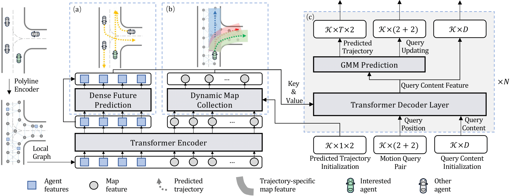
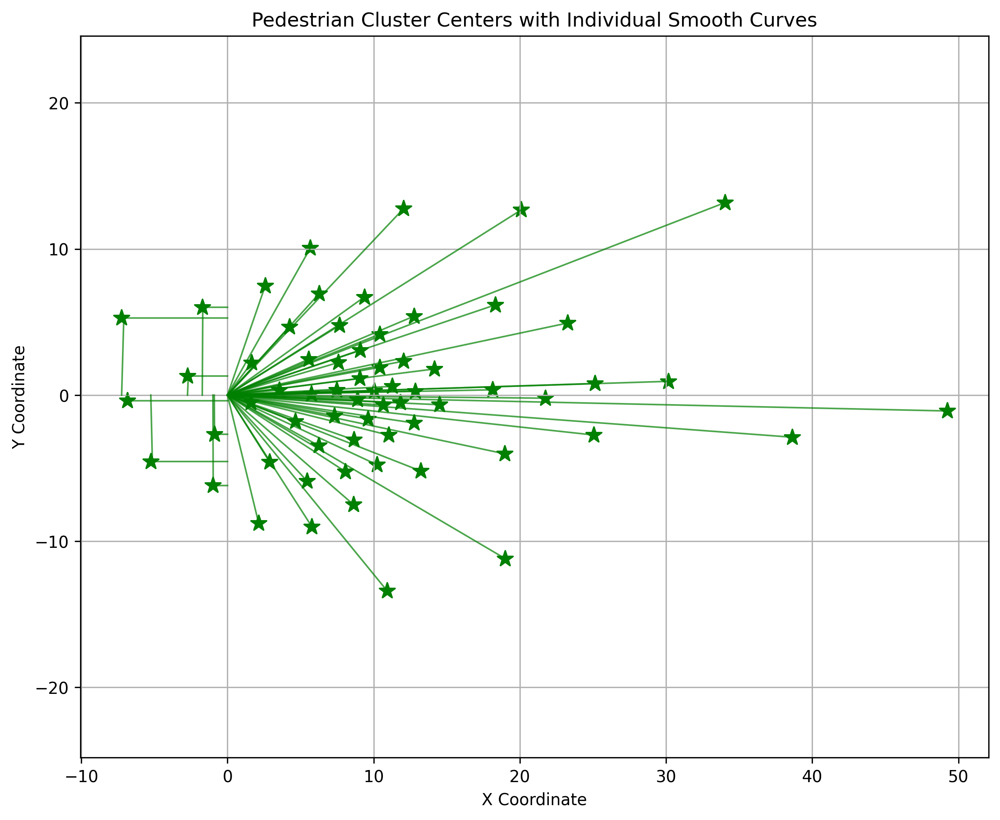

# 算法说明文档

## 算法设计

本项目算法设计主要参考 MTR ( NeurIPS 2022 )论文和 EDA (AAAI 2024 )论文：

    MTR: Motion Transformer with Global Intention Localization and Local Movement Refinement, NeurIPS 2022.

    EDA: Evolving and Distinct Anchors for Multimodal Motion Prediction,AAAI 2024.

MTR 将运动预测建模为全局意图定位和局部运动细化的联合优化。MTR 不使用目标候选，而是通过采用一组可学习的运动查询对来整合空间意图先验。每个运动查询对负责针对特定运动模式的轨迹预测和细化，从而稳定训练过程并促进更佳的多模态预测。

EDA 在MTR的基础上提出不断发展和独特锚点，用于基于混合模型的多模态运动预测中正负成分的定义。其使得锚点能够在特定场景下动态演化并重新分配自身，从而扩大回归能力。此外，在将锚点与真实轨迹匹配之前，先选择出独特的锚点。

## 算法创新点

1. 运动查询对
提出静态意图查询和动态搜索查询结合的机制：
--静态查询：通过可学习的意图点捕捉全局运动意图，每个查询负责特定运动模式，减少对密集目标候选的依赖，提升训练稳定性。
--动态查询：基于预测轨迹动态更新，通过局部地图收集模块迭代细化轨迹特征，增强轨迹细节的适应性。

2. 辅助密集未来预测任务
通过预测代理的未来轨迹和速度，编码未来交互特征，弥补现有方法仅关注历史交互的不足，提升多代理协同预测能力。

3. 进化锚点和独特锚点
在多层解码器中，利用中间层预测结果迭代更新锚点位置（例如，6层解码器中每2层更新一次锚点），使锚点能够适应场景变化。通过渐进式调整，平衡锚点初始分布与预测灵活性，避免预测过度聚集或锚点过于稀疏。同时在匹配真实轨迹前，先对锚点进行NMS筛选，去除空间相近的低分锚点，保留多样性高且置信度高的候选，缓解分类优化中的模糊性问题。

4. 多模态预测框架
基于Transformer的编码器-解码器结构，结合高斯混合模型（GMM）表示多模态轨迹分布，并通过非极大抑制（NMS）筛选最优轨迹，实现高效多模态输出。

## 效果演示

### 全局意图点演示
使用 K 均值聚类算法，对真实轨迹 (GT) 的端点进行聚类，得到 K 个代表性意图点，每个意图点代表一种隐式运动模式，该模式同时考虑运动方向和速度（本项目选择 K=64）。本人对使用的意图点进行可视化如下。

车辆全局意图点:

行人全局意图点:

自行车全局定位点:

### 预测轨迹演示
下面对东风官方提供的 processed_scenarios_testA 数据集中的部分场景的预测效果进行展示：

#### vehicle prediction

#### pedestrian prediction

#### cyclist prediction

## 未来改进方向
1.使用混合专家模型和模型蒸馏技术在满足计算效率的同时提高模型精度（大模型云端训练，蒸馏模型车端运行）

2.使用深度学习正样本训练模型并结合强化学习负样本训练模型提高模型自纠错能力（深度学习+强化学习微调）

3.探究数据质量、场景分布和数据规模对模型学习的影响

## 个人想法
1.自动驾驶真值数据集采集过程中存在目标物的出现与消失的或者数据传输丢包现象从而导致真实数据的缺失问题，**由此导致的数据集的质量问题很可能会给模型的学习带来极大的困难，同时这也给评价指标的准确性带来不可避免的影响**，以比赛方给出的 processed_scenarios_testing_A_full 数据为例，可视化真值轨迹发现部分缺失数据直接赋值为 (0,0)，由此可能导致的真值轨迹的跳变不符合常规逻辑（临近点代替或者其他更好的数据处理应该被考虑或者采取**有问题的轨迹不考虑进行预测学习的简单做法**），部分可能存在问题的真值轨迹展示:

2.深度学习中对数据集中样本一个比较重要的要求是独立同分布，但是这在自动驾驶预测及规划数据集中很难满足（大部分深度任务都很难满足，但是在自动驾驶任务中尤为明显）。由于自动驾驶数据集采集时车辆大部分行驶路况都是直行此类简单场景，这导致路口左转，变道等复杂场景的数据较少。在进行模型训练时，大量的简单场景数据会淹没少量复杂场景数据，模型学习主要取决于简单场景。

3.车辆预测/规划任务不是完全凸问题，在同样的驾驶场景下可能有多种方案（如左绕行和右绕行障碍物），但是自动驾驶数据采集时在同一时间下只能给出一种方案（即专家轨迹），这可能会导致数据集中专家轨迹数据集较为单一，评价指标简单而不完全合理。